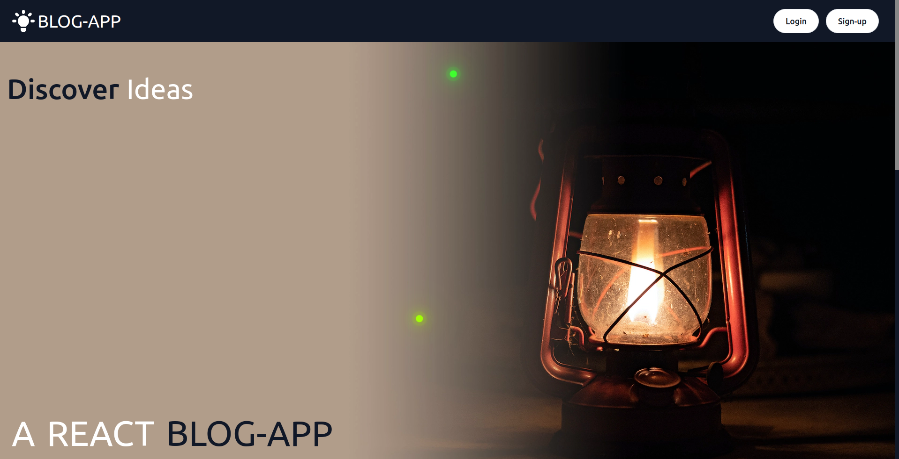

  
  
  
  
  
  

### Blog Application

Take a look at the <a href='https://kiwasthal-blog.vercel.app/'>Client Here!</a>, deployed with Vercel.

<ul>
  <li><a href='https://github.com/Kiwasthal/blog-api-client'>Visit Client Code</a></li>
  <li><a href='https://github.com/Kiwasthal/blog-api-cms'>Visit CMS Code</a></li>
  <li><a href='https://github.com/Kiwasthal/blog-api-server'>Visit API Code</a></li>
</ul>

## About

Create an back-end API then connect to two different front-ends. The CMS application is used for creating blog-content while the NextJS client is used for browsing posts,commenting && leaving likes.
